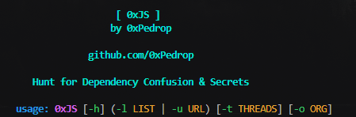

# 0xJS SCAN CHECKER 🏴‍☠️

<p align="center">
  
</p>

Uma ferramenta rápida e eficiente desenvolvida para automatizar o reconhecimento de segurança em arquivos JavaScript, focada na descoberta de segredos e potenciais alvos para **Dependency Confusion**.

##  Funcionalidades
* **Scoped Package Hunting:** Detecta pacotes com escopo (ex: `@empresa/pacote`).
* **Unscoped Import Detection:** Identifica dependências sem escopo dentro de `require()` e `import`.
* **Secret Discovery:** Busca por chaves de API, tokens e segredos via Regex.
* **Cloud Leak Search:** Localiza buckets S3 e Google Cloud Storage.
* **Org Customization:** Permite buscar padrões específicos de uma empresa (ex: `uber-internal`).

## ⚙️ Instalação Global
Para utilizar o `0xJS` como um comando global no seu sistema Linux/macOS:

```bash
# Dar permissão de execução ao arquivo
chmod +x 0xJS

# Mover para o diretório de binários do sistema
sudo mv 0xJS /usr/local/bin/
```

## 🚀 Como usar
Exemplos de uso:  
  
Analisar uma URL única: 
```bash
0xJS -u https://alvo.com/assets/main.js -o minhacorp
```
Analisar uma lista de URLs com multithreading:
```bash
0xJS -l urls_js.txt -t 100
```
## 🛠️ Argumentos
Flag | Descrição
* -u Analisa uma única URL de arquivo JS. 
* -l Caminho para um arquivo .txt contendo uma lista de URLs. 
* -o Nome da organização para busca customizada. 
* -t Número de threads (padrão: 50). 

⚖️ Licença  
Este projeto está licenciado sob a Apache License 2.0 - veja o arquivo LICENSE para detalhes.

Desenvolvido por 0xPedrop | github.com/0xPedrop
